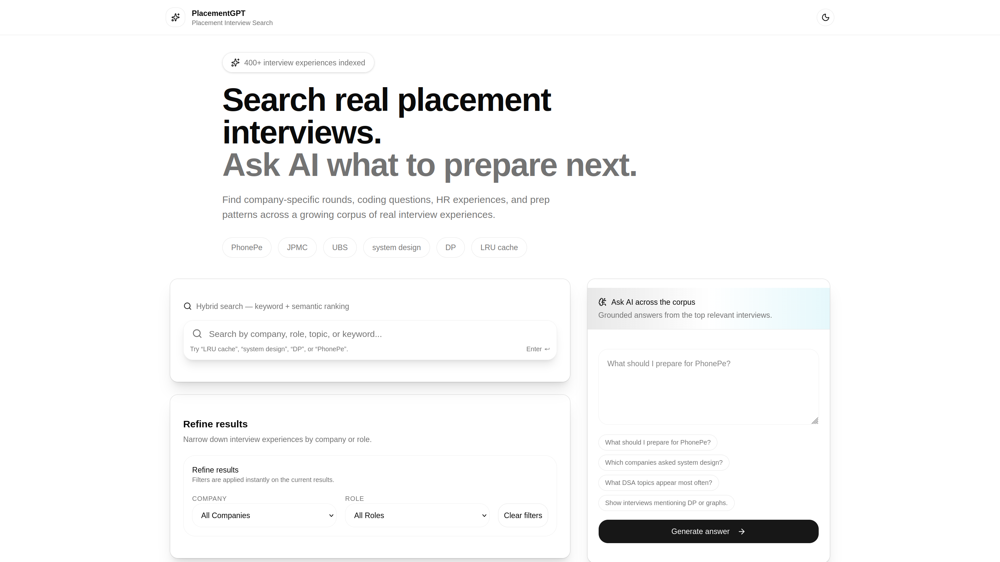
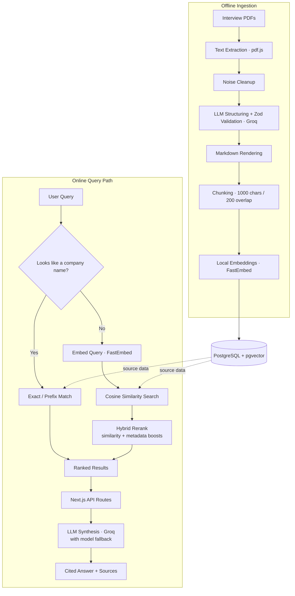

<div align="center">

# PlacementGPT

**A RAG search engine that turns a folder of placement interview PDFs into a queryable, citation-backed knowledge base.**

[](https://nextjs.org/)
[](https://react.dev/)
[](https://www.typescriptlang.org/)
[](https://neon.tech/)
[](https://github.com/pgvector/pgvector)
[](https://groq.com/)
[](https://www.prisma.io/)


</div>

---

## Motivation

Every placement season produces the same problem: hundreds of interview-experience PDFs scattered across WhatsApp groups and Drive folders, with no way to search them except scrolling. A question as simple as "what does PhonePe ask in the DSA round?" means manually opening a dozen files and skimming.

PlacementGPT ingests that raw archive, structures it with an LLM, embeds it, and exposes it through hybrid search and a Q&A interface that answers questions using only the retrieved interviews — with sources attached, so every claim can be traced back to the original PDF.

## Features

- **Hybrid search** — exact company-name matching for fast, predictable lookups, falling back to vector similarity search when the query needs semantic understanding
- **Grounded Q&A** — ask a question in plain English and get an answer synthesized strictly from retrieved interview chunks, with the source interviews cited alongside the response
- **Cached AI summaries** — each interview gets an LLM-generated summary (overview, key topics, rounds, prep advice, difficulty signal) generated once and cached in Postgres
- **Related interviews** — every interview page surfaces similar experiences using cosine similarity over its embedding
- **Multi-model resilience** — chat and summary requests automatically fall back across three Groq-hosted models (GPT-OSS 120B → Qwen3 32B → Llama 4 Scout) if one is rate-limited or down
- **Self-healing ingestion** — PDFs that are too large for a single LLM call are automatically retried with a shrinking token budget instead of failing outright
- **Local embeddings** — 384-dim vectors generated on-device via FastEmbed, so search and ingestion don't depend on a paid embeddings API
- **Fast autocomplete** — typeahead across companies, roles, and titles with weighted relevance scoring
- **Polished UI** — dark mode, smooth transitions, and a responsive layout built on shadcn/ui, Tailwind, and Framer Motion

## Demo

> Add screenshots or a short GIF for each of these — they sell the project faster than any paragraph:

# PlacementGPT

## 🏠 Home & Search



---

## 🤖 AI Q&A


---

## 📄 Interview Detail


## Architecture

PlacementGPT runs two distinct pipelines: an **offline ingestion pipeline** that turns raw PDFs into searchable rows, and an **online query path** that serves search and chat requests.



## Tech Stack

| Layer | Technology |
|---|---|
| **Frontend** | Next.js 16 (Pages Router), React 19, Tailwind CSS v4, Framer Motion, shadcn/ui, react-markdown |
| **Backend** | Next.js API Routes, Prisma ORM |
| **Database** | PostgreSQL (Neon), pgvector |
| **LLM Inference** | Groq — `openai/gpt-oss-120b`, `qwen/qwen3-32b`, `meta-llama/llama-4-scout-17b-16e-instruct` (automatic fallback chain) |
| **Embeddings** | FastEmbed, `BAAI/bge-small-en-v1.5` (384-dim), Python |
| **PDF Parsing** | pdfjs-dist |
| **Validation** | Zod |

## Search Pipeline

1. A query hits `/api/search` or `/api/chat`.
2. If the query is short, an exact/prefix match against company names is attempted first — this fast path handles the most common case ("PhonePe", "JPMC") without touching the embedding model.
3. If there's no fast-path hit, the query is embedded locally and compared against chunk embeddings using cosine distance in pgvector.
4. The top candidates are rescored by a hybrid heuristic that blends vector similarity with metadata boosts for exact, prefix, and substring matches on company, role, and title.
5. Results are collapsed to one representative chunk per interview before being returned.
6. For chat, the retrieved chunks are passed to Groq as grounding context; the model is instructed to use only that evidence, distinguish recurring patterns from one-off mentions, and decline to answer when evidence is insufficient.

## AI Ingestion Pipeline

1. Extract raw text per page with pdfjs-dist.
2. Strip page numbers, repeated headers/footers, and other OCR noise.
3. Send the cleaned text to Groq with a strict system prompt; the response is parsed and validated against a Zod schema (`company`, `role`, `candidate`, `title`, `sections`).
4. If the document is too large for one call, automatically retry with a shrinking character budget instead of failing the whole file.
5. Render the structured data to markdown and fingerprint it with SHA-256 to skip duplicate content, independent of filename.
6. Chunk the markdown and generate embeddings per chunk (and per document) via FastEmbed.
7. Write everything to PostgreSQL through Prisma, including raw `vector` columns via pgvector.
8. Run as a concurrent worker pool with built-in Groq rate-limiting and exponential backoff, and emit a JSON report of inserted / skipped / failed files after every run.

## Folder Structure

```
placementgpt/
├── pages/
│   ├── index.tsx                  # Home: search UI + AI chat
│   ├── interview/[id].tsx         # Interview detail page
│   └── api/
│       ├── search.js              # Hybrid search
│       ├── chat.js                # RAG Q&A
│       ├── autocomplete.js        # Typeahead suggestions
│       └── interview/[id]/
│           ├── summary.ts         # Cached AI summary
│           └── related.ts         # Similar interviews
├── components/
│   ├── search/                    # Search bar, filters, result cards
│   ├── layout/                    # Site header
│   └── ui/                        # shadcn primitives
├── lib/
│   ├── retrieve.js                # hybridSearch()
│   ├── groq.ts                    # Multi-model fallback client
│   └── prisma.ts
├── scripts/ingest/
│   ├── run.ts                     # Ingestion orchestrator
│   ├── chunker.ts
│   ├── embeddings.py / embed_query.py
│   └── prompts.ts
├── prisma/
│   └── schema.prisma
└── interview-data/                # Source PDFs (not committed)
```

## Local Setup

```bash
git clone <repo-url>
cd placementgpt
npm install
pip install fastembed --break-system-packages   # or use a virtualenv

cp .env.example .env   # see required variables below
npx prisma migrate dev

npm run dev
```

To ingest your own interview PDFs into `interview-data/`:

```bash
npm run ingest          # full run
npm run ingest:dry      # dry run, prints structured output without writing to the DB
```

### Environment Variables

| Variable | Required | Description |
|---|---|---|
| `DATABASE_URL` | Yes | PostgreSQL connection string (with pgvector enabled) |
| `GROQ_API_KEY` | Yes | API key for Groq inference |
| `GROQ_MODEL` | No | Override the default ingestion model (`openai/gpt-oss-120b`) |
| `PYTHON_BIN` | No | Path to the Python binary used for FastEmbed calls (defaults to `python3`) |

## Future Improvements

- User authentication and personalized dashboards with saved/bookmarked interviews, search history, and preparation progress.
- Streaming AI responses to improve perceived latency and create a more interactive chat experience.
- Advanced hybrid retrieval pipeline using techniques such as BM25, Reciprocal Rank Fusion (RRF), or cross-encoder reranking for  even higher search accuracy.
- Quantitative RAG evaluation framework to measure retrieval precision, answer faithfulness, and end-to-end response quality.
- Intelligent caching and background processing for embeddings, AI summaries, and frequently asked queries to reduce latency and API costs.

## License

Licensed under the [MIT License](LICENSE).
